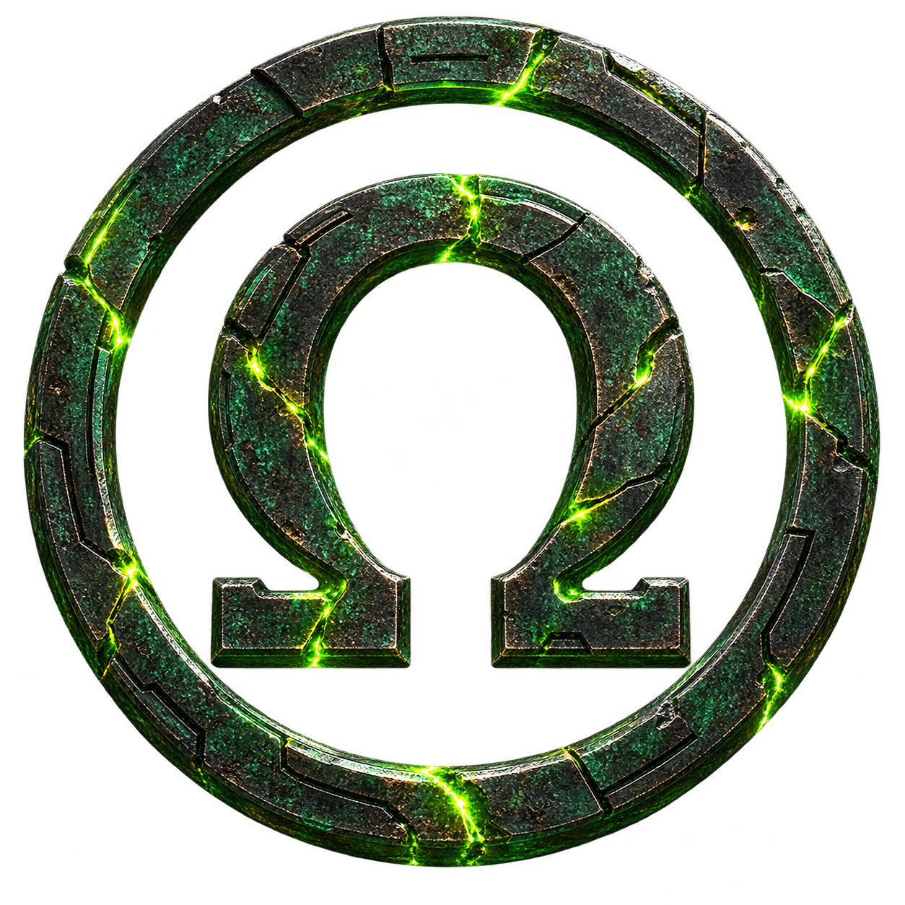

<p align="center">
  
</p>

# Omega Omarchy

**The Revolution Will Be Customized**

A fast, humorous, retro-inspired action game about escaping a corrupted
Omarchy installation. Opponents are converted, not killed. Limitless Library
is optional.

This is the Omega Omarchy organization repository. It is a **technical alpha**,
not a release candidate, public announcement, marketplace listing, or hosted
service. A maintainer-approved external preview is active; visibility and
invitations stay with the lead maintainer.

## Current snapshot — 2026-09-04

- Chapter 1 is the only end-to-end qualified player path. It covers the faux
  Omarchy install, eight-beat prologue, procedural side-scrolling, conversion
  combat, live tile editing, a field/RPG boss encounter, and a dedicated
  completion/credits boundary.
- Five later chapters, the Oligarchy/Goliath material, and their bosses are
  substantial development scaffolding, not a finished six-chapter campaign.
- Ultra is the default presentation. Sixteen-bit and High are deterministic
  derivatives that retain the same 16-pixel world and collision footprint.
- Generator compatibility is `3.8.0`. The 2026-09-03 full repository gate
  passed 298 tests with one expected skip; ordinary changes continue to use the
  issue-dependent protocol in [docs/testing.md](docs/testing.md).
- Native pygame-ce remains the primary play target. `dist/web` now packages
  the same simulation and renderer as a playable Chapter 1 browser alpha,
  including browser persistence; later chapters and external packs remain
  native-only.
- Sound now streams the supplied *Make It Come Alive* master as scene-aware
  Chapter 1, boss, and installer cues, with semantic effects, mixer buses,
  captions, and independently selectable Ultra/High/sixteen-bit fidelity.
  Public redistribution of the supplied recording remains a rights-audit gate.
- Public cutover remains **NO-GO** pending human play/pacing evidence,
  clean-machine artifact play, rights/history review, a genuine cross-install
  Limitless exchange, release media, and exact-candidate approval.

## Quick start

```bash
./scripts/omega doctor
./scripts/omega run
```

The first invocation creates `.venv` and installs the pinned development
requirements when needed. Python 3.11+ and Linux are the current targets.

Testing is deliberately issue-dependent:

```bash
./scripts/omega test tests/test_omega_milestone.py -k cannon
./scripts/omega test-scope gameplay
./scripts/omega release-check # explicit full gate; never the default
```

Other useful commands:

```bash
./scripts/omega web
./scripts/omega web-serve
./scripts/omega audio
./scripts/omega package
./scripts/omega validate-pack examples/content-packs/vertical-garden
./scripts/omega review-pack examples/content-packs/vertical-garden
./scripts/omega install-pack examples/content-packs/vertical-garden --accept
./scripts/omega enable-pack example.vertical-garden
./scripts/omega run
```

See [docs/build.md](docs/build.md) for setup and commands and
[docs/testing.md](docs/testing.md) for verification scope.

The installer parody performs deterministic world preparation and finishes on
**Play Now**, not Reboot Now.

## Docs

- [Open-source cutover gates](docs/OPEN-SOURCE-CUTOVER.md)
- [Contributing](CONTRIBUTING.md)
- [Governance](GOVERNANCE.md)
- [Roadmap](ROADMAP.md)
- [Security](SECURITY.md)
- [Release notes](docs/release-notes.md)
- [Architecture](docs/architecture.md)
- [Controls](docs/controls.md)
- [Accessibility](docs/accessibility.md)
- [Build / package](docs/build.md)
- [Browser build](docs/web.md)
- [Sound support and fidelity](docs/sound-support.md)
- [Issue-dependent testing](docs/testing.md)
- [Native release artifact](docs/release-artifact.md)
- [Release and history audit](docs/release-audit.md)
- [Data-only content packs](docs/content-packs.md)
- [Installer study](docs/installer-study.md)

## License status

Package metadata currently declares MIT for the source code, but the required
pre-public code/asset/branding/likeness rights pass is not complete. Do not
interpret that declaration as granting trademark, publicity, or third-party
asset rights. The official Omarchy wordmark source is identified under
`assets/source/branding/`; private likeness-reference photographs are not in
this repository. See the open-source cutover gates before any distribution.
The provisional scope is detailed in [ASSET-LICENSE.md](ASSET-LICENSE.md), with
runtime/component attribution in
[THIRD_PARTY_NOTICES.md](THIRD_PARTY_NOTICES.md).
