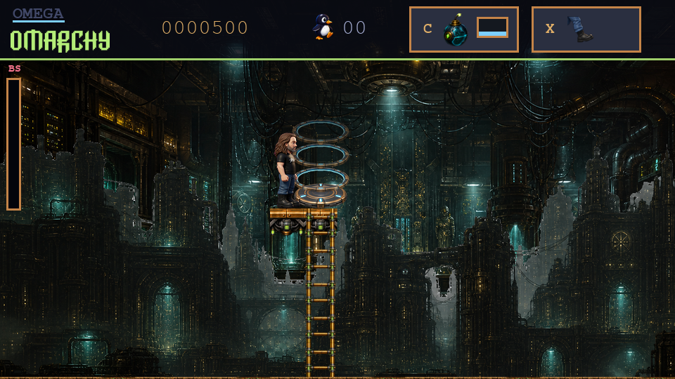

<p align="center">
  
</p>

# Omega Omarchy

**The revolution will be customized.**

A free, open-source action-platformer about a Linux installation that goes
spectacularly off script. Choose a character, configure your world, and watch
a perfectly normal setup become a very abnormal adventure. Jump, slide, climb,
convert your opponents, and step over your character's shoulder to edit the
terrain itself.

**[Play in your browser](https://omegaomarchy.org/play/)** ·
[Website](https://omegaomarchy.org/) · [News](https://omegaomarchy.org/news/) ·
[Controls](docs/controls.md) · [Contribute](CONTRIBUTING.md)

[](https://github.com/Omega-Omarchy/omega-omarchy/actions/workflows/ci.yml)
[](https://github.com/Omega-Omarchy/omega-omarchy/actions/workflows/codeql.yml)



## What's playable

The public launch is **Chapter 1: The Corrupted Install**, from the faux setup
and consciousness-transfer prologue through procedural platforming, a boss
encounter, and the chapter-completion screen. The five later chapters and the
Goliath finale are in development; they are not a finished six-chapter campaign.

- **Choose your protagonist.** Play as David, The Omarch King, or The Omarch
  Queen. Give an image-capable agent the [character kit](docs/character-creation.md)
  to create a complete replacement character, then import its ZIP.
- **Change the level.** Over-the-shoulder customization lets you edit terrain
  and earn access to elevated skyways. The [browser level editor](docs/level-workshop.md)
  also supports tile painting, zoom, undo, and traversal checks.
- **Find another way through.** Chapter 1's [route grammar](docs/chapter-one-level-design.md)
  varies traversal, encounters, and optional exploration across seeded maps.
  [Invisible platforms and workshop skyways](docs/skyways.md) add hidden routes.
- **Convert the opposition.** Combine movement and kicks with tactical RPG
  encounters, reasoning, patches, and recruited companions.
- **Pick your presentation.** Independent 16-bit, High, and Ultra graphics and
  audio settings share the same movement and collision rules. Keyboard and
  controller bindings can be remapped; accessibility options live in Pause.
- **Stay for the credits.** The cinematic roll credits contributors from Git
  history, supports preferred names, and plays Jeremy Dixon's *Super Key Love*.
  [Credits documentation](docs/credits.md) explains the cast sequence and music
  attribution. F11 opens the roll; F12 opens the cast sequence followed by it.

This is a game, not an operating-system installer. The setup configures the
game and prepares its world; it does not repartition your computer. Native play
works offline. Limitless Library integration is optional and opt-in. The
browser's initial download needs a network connection, and saves and imported
characters stay in that browser's local storage.

## Run from source

Linux with **Python 3.11 or 3.12** is the supported development target. Install
Python's `venv` support if your distribution packages it separately.

```sh
git clone https://github.com/Omega-Omarchy/omega-omarchy.git
cd omega-omarchy
./scripts/omega doctor
./scripts/omega run
```

The launcher creates `.venv` and installs pinned dependencies on first use.
FFmpeg, including `ffprobe`, is needed when rebuilding audio, credits, and
release artifacts. Native rendering uses pygame-ce; the browser version uses
the same Python simulation and renderer through pygbag/WebAssembly.

| Action | Default keys |
| --- | --- |
| Move / sprint | Left–Right or A–D; double-tap a direction to sprint |
| Jump / double jump | Space or Z; press again in the air |
| Kick / use item | X / C |
| Interact / confirm | E / Enter |
| Climb / slide | Up–Down; Down plus movement to slide |
| Pause / settings | Esc |

See the [full controls](docs/controls.md) and [accessibility options](docs/accessibility.md).

## Build, edit, and test

```sh
./scripts/omega web             # Build the browser game
./scripts/omega web-serve       # Serve that build locally
./scripts/omega editor          # Browser level editor and traversal checks
./scripts/omega website         # Build the website with a fresh browser game
./scripts/omega website-serve   # Preview it at http://127.0.0.1:8820/
./scripts/omega credits         # Rebuild deterministic contributor/music credits
```

Use focused tests during development, then the repository gate before a
release or a change spanning multiple systems. The full suite also exercises
optional audio-authoring tools; install those test dependencies first with
`.venv/bin/python -m pip install -e ".[audio-authoring]"`.

```sh
./scripts/omega test-scope gameplay
./scripts/omega test tests/test_generation.py
./scripts/omega release-check
```

Website contributors also need **Node.js 24+** for the browser logic tests;
there is no npm dependency installation:

```sh
node --test website/motion.test.mjs website/news.test.mjs tests/level_editor_state.test.cjs
.venv/bin/python -m unittest discover -s website -p 'test_*.py'
.venv/bin/python website/check.py
```

CI runs the Python matrix, deterministic gates, website/editor checks, and
native artifact verification. CodeQL covers Python, JavaScript, and Actions;
dependency review checks pull requests, daily audits check pinned Python
packages, and Dependabot proposes weekly updates. Maintainer setup and required
checks are documented in [GitHub repository setup](docs/github-setup.md).

## Contribute and customize

Bug reports, accessibility improvements, level ideas, art, audio, performance
work, and data-only content packs are welcome. Start with
[CONTRIBUTING.md](CONTRIBUTING.md), the issue templates, and the project's
[governance](GOVERNANCE.md). Changes should include focused evidence and asset
provenance where relevant. Contributors can set their screen-credit name in
[credits/contributors.toml](credits/contributors.toml).

- [Architecture](docs/architecture.md) and [build instructions](docs/build.md)
- [Testing scopes](docs/testing.md) and [browser runtime](docs/web.md)
- [Rendering performance and repeatable browser benchmarks](docs/performance.md)
- [Content packs](docs/content-packs.md) and [character creation](docs/character-creation.md)
- [Audio and fidelity](docs/sound-support.md)
- [Website development](website/README.md) and [deployment runbook](website/deploy/README.md)
- [Roadmap](ROADMAP.md), [release notes](docs/release-notes.md), and [release audit](docs/release-audit.md)
- [Report a vulnerability privately](SECURITY.md)

## License and attribution

The source code is available under the [MIT license](LICENSE). Game artwork,
recordings, fonts, names, and branding have separate terms documented in
[ASSET-LICENSE.md](ASSET-LICENSE.md) and
[THIRD_PARTY_NOTICES.md](THIRD_PARTY_NOTICES.md); the code license does not
relicense those assets. Music credits use embedded author/artist fields, with
reviewed external attribution when those fields are absent.

Omega Omarchy is an independent parody inspired by Linux culture, user-owned
computing, and [Omarchy](https://omarchy.org/). It is not an official Omarchy
release or an endorsement by the people and projects depicted.
